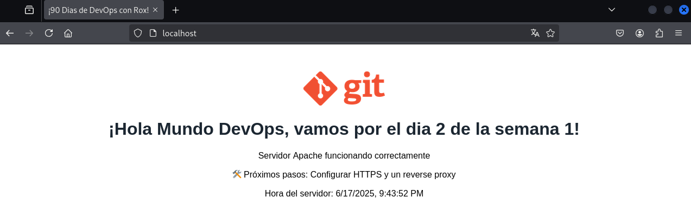

# 90-Dias-de-DevOps-con-Roxs

## Semana 1 - Dia 2

### <ins> Tarea 1: Desplegando un "Hola Mundo" en Apache </ins>

***Codigo HTML (Con agregados de desafio)***

```
<!DOCTYPE html>
<html>
<head>
    <meta charset="utf-8">
    <title>¡90 Dias de DevOps con Rox!</title>
    <style>
        body { font-family: Arial, sans-serif; text-align: center; margin-top: 50px; }
        h1 { color: #1b2631; }
        .logo { width: 150px; }
    </style>
</head>
<body> 
    
    <h1>¡Hola Mundo DevOps, vamos por el dia 2 de la semana 1!</h1>
    <p>Servidor Apache funcionando correctamente</p>
    <p>🛠 Próximos pasos: Configurar HTTPS y un reverse proxy</p>
        <div class="server-time">
                <script>
                    document.write("Hora del servidor: " + new Date().toLocaleString());
                </script>
        </div>
</body>
</html>
```

***Pagina Web***



### <ins> Tarea 2: Opcional </ins>

+ **1 - Exploracion Basica**

*Mostrar la sesion actual*
```
$ whoami
kali
```
*Mostrar la ruta absoluta donde estamos posicionado*
```
$ pwd
/home/kali
```
*Lista todos los archivos y carpetas, con sus respectivos atributos y permisos, junto con el usuario que lo creo*
```
$ ls -lah
total 184K
drwx------ 16 kali kali 4.0K Jun 17 20:39 .
drwxr-xr-x  3 root root 4.0K May 29 15:25 ..
-rw-r--r--  1 kali kali  220 May 29 15:25 .bash_logout
-rw-r--r--  1 kali kali 5.5K May 29 15:25 .bashrc
-rw-r--r--  1 kali kali 3.5K May 29 15:25 .bashrc.original
drwxrwxr-x 10 kali kali 4.0K Jun 17 20:25 .cache
drwxr-xr-x 11 kali kali 4.0K Jun 17 20:17 .config
drwxr-xr-x  2 kali kali 4.0K Jun 17 20:17 Desktop
-rw-r--r--  1 kali kali   35 Jun 17 20:17 .dmrc
drwxr-xr-x  2 kali kali 4.0K Jun 17 20:17 Documents
drwxr-xr-x  2 kali kali 4.0K Jun 17 20:17 Downloads
-rw-r--r--  1 kali kali  12K May 29 15:25 .face
lrwxrwxrwx  1 kali kali    5 May 29 15:25 .face.icon -> .face
drwx------  3 kali kali 4.0K Jun 17 20:17 .gnupg
-rw-------  1 kali kali    0 Jun 17 20:17 .ICEauthority
drwxr-xr-x  3 kali kali 4.0K May 29 15:25 .java
drwxr-xr-x  5 kali kali 4.0K Jun 17 20:17 .local
drwx------  4 kali kali 4.0K Jun 17 20:25 .mozilla
drwxr-xr-x  2 kali kali 4.0K Jun 17 20:17 Music
drwxr-xr-x  2 kali kali 4.0K Jun 17 20:17 Pictures
-rw-r--r--  1 kali kali  807 May 29 15:25 .profile
drwxr-xr-x  2 kali kali 4.0K Jun 17 20:17 Public
-rw-r--r--  1 kali kali    0 Jun 17 20:17 .sudo_as_admin_successful
drwxr-xr-x  2 kali kali 4.0K Jun 17 20:17 Templates
drwxr-xr-x  2 kali kali 4.0K Jun 17 20:17 Videos
```
*Muestra los sistemas de archivos montados, con su respectivo espacio y en un formato legible para el operador*
```
$  df -hT
Filesystem     Type      Size  Used Avail Use% Mounted on
udev           devtmpfs  1.9G     0  1.9G   0% /dev
tmpfs          tmpfs     393M  992K  392M   1% /run
/dev/sda1      ext4       79G   15G   60G  21% /
tmpfs          tmpfs     2.0G  4.0K  2.0G   1% /dev/shm
tmpfs          tmpfs     5.0M     0  5.0M   0% /run/lock
tmpfs          tmpfs     1.0M     0  1.0M   0% /run/credentials/systemd-journald.service
tmpfs          tmpfs     2.0G  8.0K  2.0G   1% /tmp
tmpfs          tmpfs     1.0M     0  1.0M   0% /run/credentials/getty@tty1.service
tmpfs          tmpfs     393M  132K  393M   1% /run/user/1000
```
*Muestra la hora del equipo, junto el tiempo del equipo en funcionamiento*
```
$ uptime
22:56:52 up  2:29,  1 user,  load average: 0.23, 0.10, 0.02
```
*Navegacion por archivos de sistema*
```
$ cd /

$ ls
bin  boot  dev  etc  home  initrd.img  initrd.img.old  lib  lib32  lib64  lost+found  media  mnt  opt  proc  root  run  sbin  srv  swap  sys  tmp  usr  var  vmlinuz  vmlinuz.old

$ cd /etc && ls
adduser.conf            cron.d                    environment         gvm              ldap                manpath.config  nsswitch.conf      protocols          sane.d             subgid               update-motd.d
alsa                    cron.daily                environment.d       hdparm.conf      ld.so.cache         matplotlibrc    ODBCDataSources    proxychains4.conf  scalpel            subgid-              UPower
alternatives            cron.hourly               ethertypes          host.conf        ld.so.conf          mime.types      odbc.ini           pulse              screenrc           subuid               usb_modeswitch.conf
apache2                 cron.monthly              ettercap            hostname         ld.so.conf.d        minicom         odbcinst.ini       python2.7          sddm.conf.d        subuid-              usb_modeswitch.d
apparmor                crontab                   firebird            hosts            legion.conf         miredo          openal             python3            searchsploit_rc    subversion           vconsole.conf
apparmor.d              cron.weekly               firefox-esr         hosts.allow      libao.conf          miredo.conf     OpenCL             python3.13         security           sudo.conf            vdpau_wrapper.cfg
apt                     cron.yearly               fonts               hosts.deny       libaudit.conf       mke2fs.conf     openni2            radcli             selinux            sudoers              vim
arp-scan                cryptsetup-initramfs      freetds             idmapd.conf      libblockdev         ModemManager    opensc             rc0.d              sensors3.conf      sudoers.d            vpnc
avahi                   cryptsetup-nuke-password  fstab               ifplugd          libccid_Info.plist  modprobe.d      openvas            rc1.d              sensors.d          sudo_logsrvd.conf    vulkan
bash.bashrc             crypttab                  fuse.conf           ImageMagick-7    libnl-3             modules         openvpn            rc2.d              services           supercat             wgetrc
bash_completion         cupshelpers               gai.conf            inetsim          libpaper.d          modules-load.d  opt                rc3.d              sgml               sv                   wireshark
bash_completion.d       dbus-1                    geoclue             init.d           lightdm             mosquitto       os-release         rc4.d              shadow             sysctl.d             wpa_supplicant
bindresvport.blacklist  dconf                     ghostscript         initramfs-tools  lighttpd            motd            pam.conf           rc5.d              shadow-            sysstat              X11
binfmt.d                debconf.conf              glvnd               inputrc          locale.alias        mtab            pam.d              rc6.d              shells             systemd              xattr.conf
bluetooth               debian_version            gnome-system-tools  insserv.conf.d   locale.conf         mysql           paperspecs         rcS.d              skel               terminfo             xdg
ca-certificates         default                   gophish             ipp-usb          locale.gen          nanorc          passwd             reader.conf.d      smartd.conf        texmf                xfce4
ca-certificates.conf    deluser.conf              gprofng.rc          ipsec.conf       localtime           netconfig       passwd-            rearj.cfg          smartmontools      theHarvester         xml
chatscripts             depmod.d                  groff               ipsec.d          logcheck            netsniff-ng     perl               redis              smi.conf           tightvncserver.conf  xrdp
chromium                dhcp                      group               ipsec.secrets    login.defs          network         php                redsocks.conf      snmp               timidity             zsh
chromium.d              dhcpcd.conf               group-              issue            logrotate.conf      NetworkManager  plymouth           request-key.conf   speech-dispatcher  tmpfiles.d           zsh_command_not_found
cifs-utils              dictionaries-common       grub.d              issue.net        logrotate.d         networks        polkit-1           request-key.d      sqlmap             ts.conf
cloud                   dns2tcpd.conf             gshadow             java-21-openjdk  macchanger          nfs.conf        postgresql         resolv.conf        ssh                ucf.conf
colord                  doc-base                  gshadow-            john             machine-id          nfs.conf.d      postgresql-common  responder          ssl                udev
console-setup           dpkg                      gss                 kali-menu        magic               nftables.conf   powershell-empire  rmt                sslsplit           udisks2
cracklib                e2scrub.conf              gtk-2.0             kernel           magic.mime          nginx           ppp                rpc                strongswan.conf    ufw
credstore               eac                       gtk-3.0             keyutils         mailcap             nikto.conf      profile            runit              strongswan.d       unicornscan
credstore.encrypted     emacs                     guymager            kismet           mailcap.order       nsisconf.nsh    profile.d          samba              stunnel            updatedb.conf

$ cd /home && ls
kali
```


+ **2 - Creacion y manipulacion de archivos**

*$ mkdir ~/dia2-devops && cd ~/dia2-devops*
```
$ ls
Descargas  Desktop  dia2-devops  Documentos  Documents  Escritorio  Imágenes  Música  Pictures  Plantillas  Público  Vídeos
```
*$ echo 'Hola Roxs 90 dias DevOps!' > saludos.txt*  
*Se Corrigio la comilla doble por la simple, ya que la doble, al tener el simbolo !, esperaba un comando*
```
$ tail saludos.txt
Hola Roxs 90 dias DevOps!
```
*cp saludos.txt copia.txt*
```
$ ls
copia.txt  saludos.txt
```
*mv copia.txt hola.txt*
```
$ ls
hola.txt  saludos.txt
```
*rm saludos.txt*
```
$ ls
hola.txt
```

+ **3 - Usuarios y permisos**

*sudo adduser invitado*
```
[sudo] contraseña para kali: 
Nueva contraseña: 
Vuelva a escribir la nueva contraseña: 
passwd: contraseña actualizada correctamente
Cambiando la información de usuario para invitado
Introduzca el nuevo valor, o pulse INTRO para usar el valor predeterminado
        Nombre completo []: 
        Número de habitación []: 
        Teléfono del trabajo []: 
        Teléfono de casa []: 
        Otro []: 
Is the information correct? [Y/n] y
```
*$ sudo groupadd roxsdevs*  
*$ sudo usermod -aG roxsdevs invitado*  
*$ chmod 740 hola.txt*  
*$ ls -l hola.txt*
```
-rwxr----- 1 kali kali 26 jun 17 23:38 hola.txt
```
+ **4 - Buscá archivos con permisos peligrosos**

*find / -type f -perm 0777 2>/dev/null*
```
En el entorno de prueba, no se detecto ningun archivo peligrosos y permisivos
```

+ **5 - Reto de comprensión**

*chmod u=rwx,g=rx,o= hola.txt*
```
Lo que se esta estableciendo son los permisos para el archivo hola.txt
* El usuario Owner (u) tendra todos los permisos de Lectora, escritura y ejecucion.
* El grupo asociado (g) al owner solo tendra permisos de lectura y ejecucion.
* Los otros usuarios (o) no tienen permisos.
``` 

+ **6 - Bonus: Compartí tu terminal**

*tree ~/dia2-devops*
```
/home/kali/dia2-devops
└── hola.txt

1 directory, 1 file
```
