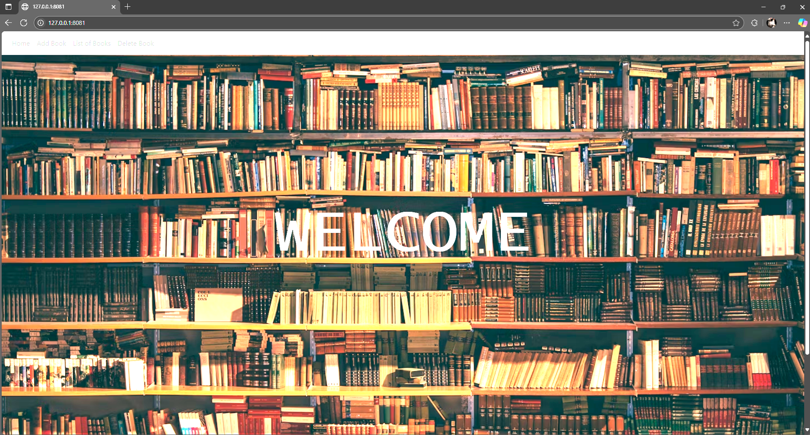

# 90-Dias-de-DevOps-con-Roxs

## Semana 1 - Dia 3

## 📚 BookLibrary - Despliegue Automático con Vagrant, Gunicorn y Nginx

Proyecto de despliegue automático de una aplicación Flask de gestión de libros, usando:
- Vagrant
- VirtualBox
- Gunicorn 
- Nginx 
- Bash script

---

## ✨ Descripción

Este proyecto crea automáticamente una máquina virtual (Ubuntu 20.04) que:
- Clona el repositorio `devops-static-web` rama `booklibrary`
- Instala dependencias (Python, pip, venv, Gunicorn, Nginx)
- Configura un entorno virtual
- Levanta Gunicorn como servicio con systemd
- Configura Nginx para exponer la app en el puerto 80

✅ Todo queda automatizado: solo tenés que hacer `vagrant up` y acceder a la IP que te muestra al finalizar.

