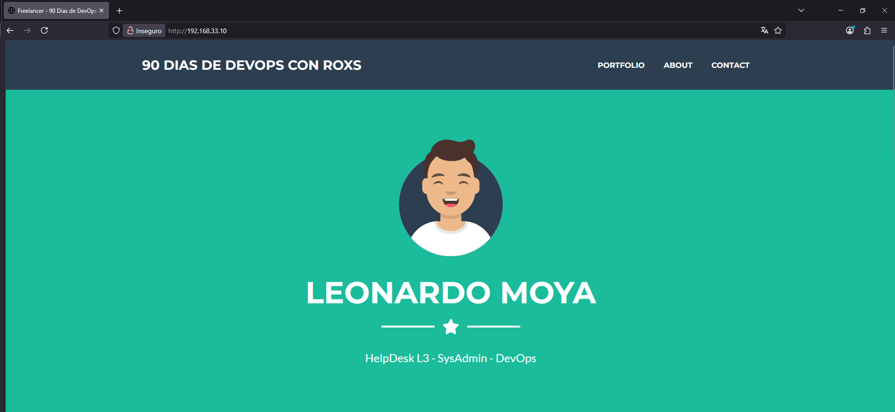

# 90-Dias-de-DevOps-con-Roxs

## Semana 1 - Dia 6

## Despliegue Fullstack Freelancer con Ansible + Vagrant

Este proyecto despliega automáticamente una landing page personalizada en Nginx, usando Ansible y Vagrant, con una estructura de roles. 
Incluye además la creación de un usuario `devops`, reglas de firewall y la instalación opcional de Docker, Node.js y Python para futuros despliegues.

---

## 📂 **Estructura del proyecto**
```plaintext
.
├── Vagrantfile
├── desplegar_app.yml
├── web-s1d6.zip
├── inventories/
│   └── vagrant/
│       └── hosts.ini
├── group_vars/
│   └── all.yml
└── roles/
    ├── app/
    │   ├── tasks/
    │   │   └── main.yml
    │   └── handlers/
    │       └── main.yml
    ├── nginx/
    │   └── tasks/main.yml
    ├── devops/
    │   └── tasks/main.yml
    ├── firewall/
    │   └── tasks/main.yml
    ├── docker/
    │   └── tasks/main.yml
    ├── nodejs/
    │   └── tasks/main.yml
    └── python/
        └── tasks/main.yml
```

